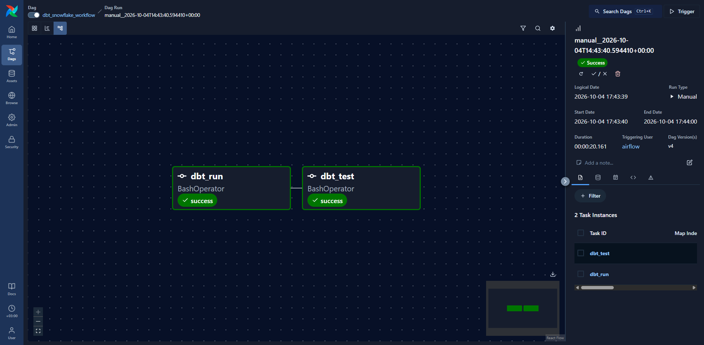
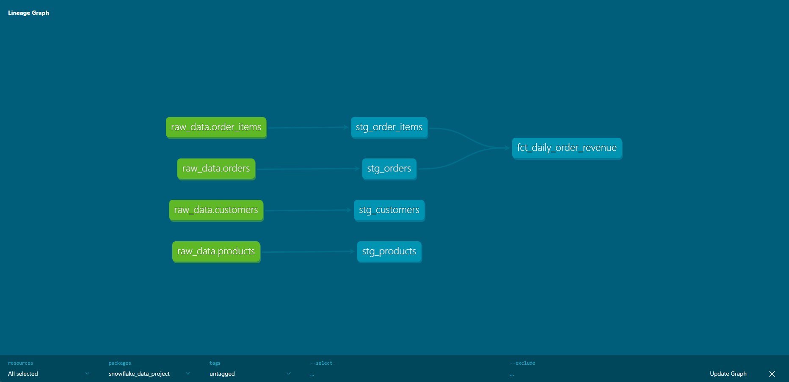
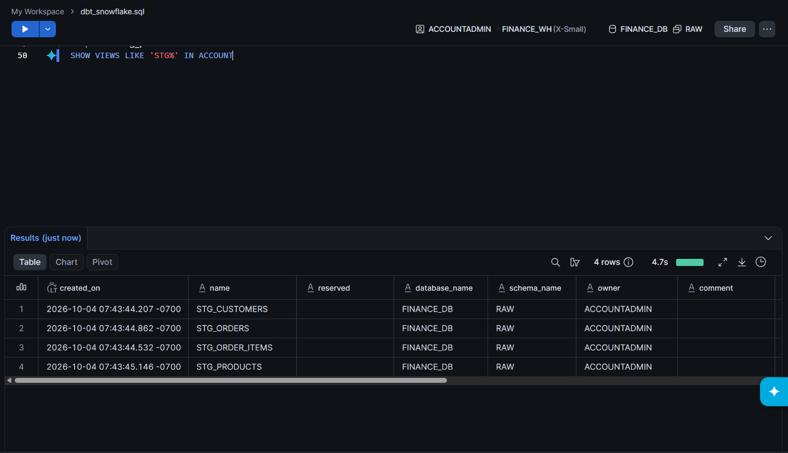

Welcome to your new dbt project!

# dbt + Snowflake + Airflow Pipeline

An end-to-end analytics pipeline: dbt models on Snowflake, orchestrated daily by Apache Airflow running in Docker.

## Architecture

Source tables (Snowflake) -> dbt staging views -> dbt mart table -> data tests -> Airflow schedule

## What's inside

- **Staging layer (views):** `stg_customers`, `stg_orders`, `stg_order_items`, `stg_products`
- **Mart layer (table):** `fct_daily_order_revenue` - daily revenue aggregated from orders and order items
- **Data tests:** `not_null` and `unique` checks on key columns
- **Orchestration:** an Airflow DAG (`dbt_snowflake_workflow`) runs `dbt run` then `dbt test` every day

## Screenshots

**Airflow DAG (dbt run -> dbt test):**



**dbt lineage graph:**



**Staging views created in Snowflake:**



## Tech stack

dbt Core, Snowflake, Apache Airflow 3, Docker Compose, Python

## Project structure

```
models/
  staging/      # cleaned source data (views) + sources.yml
  marts/        # business-level tables
tests/          # data tests
airflow/
  Dockerfile            # Airflow image with dbt installed in an isolated venv
  docker-compose.yaml   # Airflow services (Celery executor)
  dags/dbt_dag.py       # the orchestration DAG
```

## How to run

1. Create your own `profiles.yml` with your Snowflake credentials (not included in this repo).
2. Run dbt locally:
```
   dbt run
   dbt test
```
3. Run Airflow:
   - In `airflow/docker-compose.yaml`, change the two local paths under `volumes:` to your own paths (dbt project folder and `.dbt` folder).
   - Create a `.env` file next to it containing `AIRFLOW_UID=50000`.
   - Then:
```
   docker compose build
   docker compose up airflow-init
   docker compose up -d
```
   - Open http://localhost:8081 (login: airflow / airflow, the default local-only credentials), unpause `dbt_snowflake_workflow` and trigger it.

## Lessons learned

- dbt is installed in its own virtualenv inside the Airflow image to avoid dependency conflicts with Airflow.
- Sharing the `target/` folder between Windows and the container caused partial-parse errors, fixed by running dbt with `--no-partial-parse` and a container-local `--target-path`.


